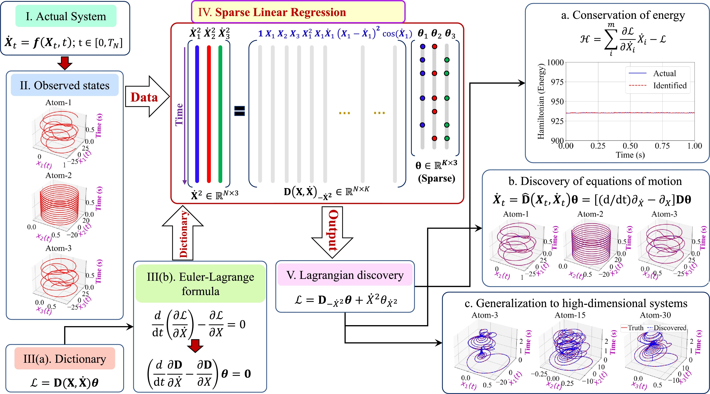

# Lagrange_Discovery_CPC
Discovering interpretable Lagrangian of dynamical systems from data

This repository contains the python codes of the paper 
  > + Tapas Tripura and Souvik Chakraborty (2023). Discovering interpretable Lagrangian of dynamical systems from data. [Paper](https://doi.org/10.1016/j.cpc.2023.108960)



# Files
  + `1) lagrange_harmonic.py` This code is for discovering Lagrangian of Harmonic oscilator.
  + `1) lagrange_forced.py` This code is for discovering Lagrangian of 1D Burgers' equation.
  + `1) lagrange_pendulam.py` This code is for discovering Lagrangian of 1D Burgers' equation.
  + `1) lagrange_3DOF.py` This code is for discovering Lagrangian of 1D Burgers' equation.
  + `1) lagrange_molecule.py` This code is for discovering Lagrangian of 1D Burgers' equation.
  + `1) lagrange_wave.py` This code is for discovering Lagrangian of 1D Burgers' equation.
  + `1) lagrange_Blade.py` This code is for discovering Lagrangian of 1D Burgers' equation.
  + `1) lagrange_NS.py` This code is for discovering Lagrangian of 1D Burgers' equation.
  + `1) utils.py` This code contains useful functions for sparse regression.
  + `1) utils_data.py` This code contains useful functions for data-generation for ODEs.
  + `1) utils_data_identified.py` This code contains useful functions for data-generation for ODEs.
  + `1) utils_data_pde.py` This code contains useful functions for data-generation for PDEs.
  + `1) case_generalization.py` This code is for the case study of 30-link atomic chain.
  + `1) beam3fun.py` This code contains functions for Euler-Bernoulli beam simulation.

# BibTex
If you take help of our codes, please cite us at,
```
@article{TRIPURA2023108960,
title = {Discovering interpretable Lagrangian of dynamical systems from data},
journal = {Computer Physics Communications},
pages = {108960},
year = {2023},
issn = {0010-4655},
doi = {https://doi.org/10.1016/j.cpc.2023.108960},
url = {https://www.sciencedirect.com/science/article/pii/S0010465523003053},
author = {Tapas Tripura and Souvik Chakraborty}
}
```
